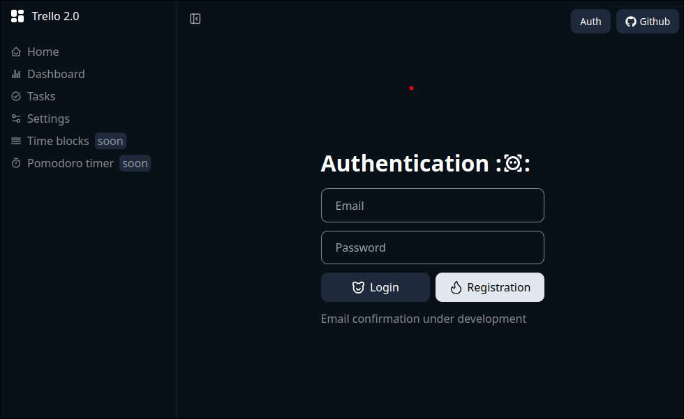
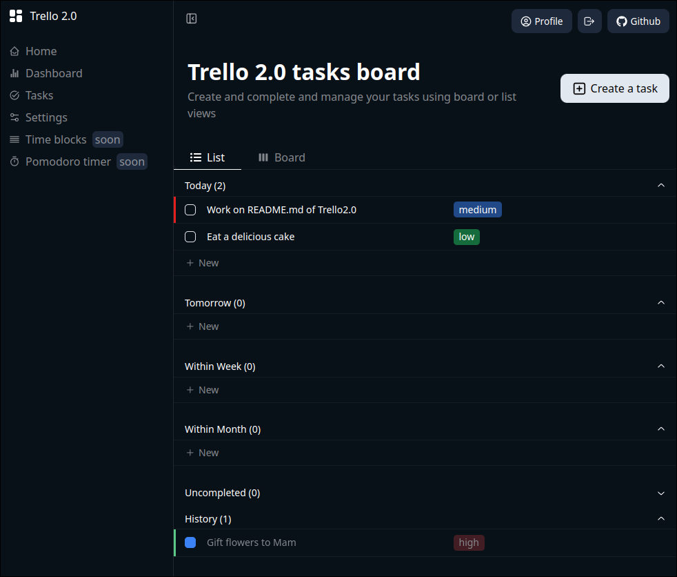
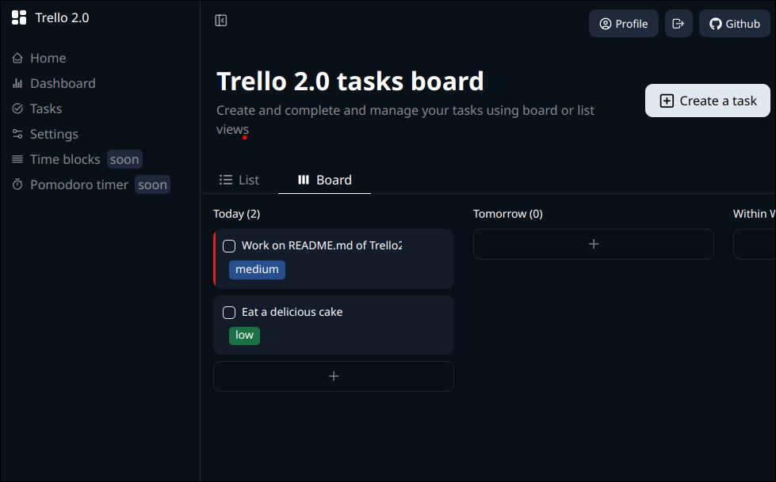
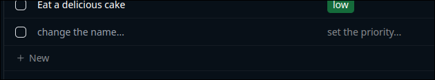
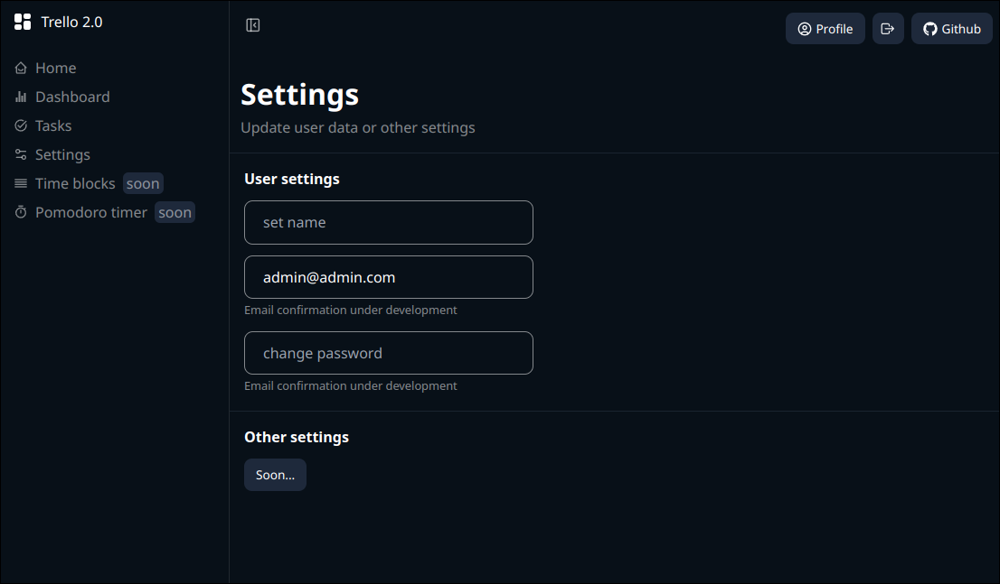

# Trello2.0

https://trello2portfolio.site/ or https://frontend-production-1f31.up.railway.app/

This project is next gen of trello. With powerful functionality to setup your workflow. Improve your productivity using features of this project.

## Tech stack

- **Frameworks:** [NestJS](https://nestjs.com/), [Next.js](https://nextjs.org/)
- **Database, ORM:** [PostgreSQL](https://www.postgresql.org/), [Prisma](https://www.prisma.io/)
- **Architecture:** Monolith, RESTful
- **Authentication:** JWT with access and refresh tokens
- **Styling:** [SCSS](https://sass-lang.com/), [TailwindCSS](https://tailwindcss.com/),
- **State:** [Redux toolkit](https://redux-toolkit.js.org/)
- **Caching:** [Redis](https://redis.io/), [TanstackQuery](https://tanstack.com/query/latest)
- **Containerizing:** [Docker](https://www.docker.com/)

### Planed to add

- **Email:**: Self
- **Caching:** [Redis](https://redis.io/)
- **CI/CD:** Github actions

## Features

- **Authentication:** to control access to tasks and other.
  

- **Tasks:** manage tasks in a time-funnel method in your project. Two views for a better experience: list and board. You can create, update, move, and more. Tasks can change their own group (today, tomorrow, etc.) to a more suitable group over time.
  
  
  

- **Settings:** update your details and more with this page. Just write actual data and all will update automatically.
  

- Dashboard and statistics.
- Schedule for your daily work.
- Pomodoro timer for improve tasks performance.
